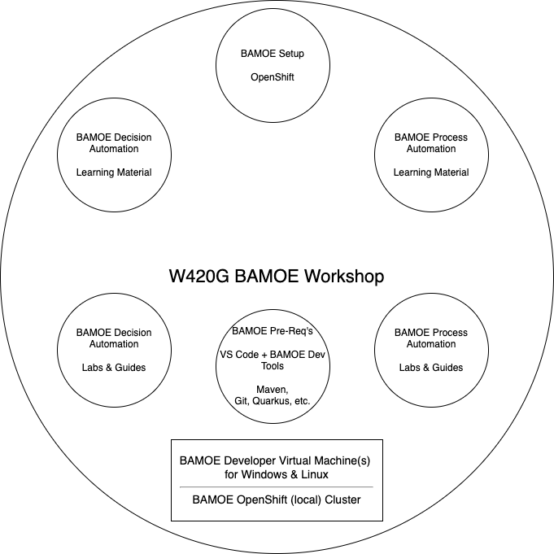

# IBM Business Automation Manager Open Editions Workshop (WB420G)
Workshop content for instructors and students.

## Overview
This workshop includes the following repositories:

- [Student Documentation](https://github.com/bamoe-workshop/student-documents) - Student version of the workshop lab guides and presentations.
- [Student Labs](https://github.com/bamoe-workshop/student-labs) - Student version of the workshop labs.
- [Student Final Examination](https://github.com/bamoe-workshop/student-examination) - Final student eworkshop examination.
- [Instructor Labs](https://github.com/bamoe-workshop/instructor-labs) - A set of pre-built labs, used for demonstration and guidance through student labs.
- [Instructor Documentation](https://github.com/bamoe-workshop/instructor-documents) - Instructor versin of the workshop lab guides and presentations.
- [BAMOE Setup](https://github.com/bamoe-workshop/bamoe-setup) - A set of instructions on how to setup IBM BAMOE.
- [BAMOE Maven](https://github.com/bamoe-workshop/bamoe-maven) - A set of custom Maven project generators for IBM BAMOE.
- [BAMOE Examples](https://github.com/bamoe-workshop/bamoe-examples) - IBM BAMOE product examples.

## Student Virtual Machine Accounts
Each student has a choice of underlying operating system for doing IBM BAMOE development, either **Linux** or **Windows**:

  - **Linux Virtual Machine**
    - Username: ibmuser
    - Password: Passw0rd
    - Root: 1l0veibmrh
    - OpenShift Username: developer
    - OpenShift Password: developer
    - OpenShift Admin Username: kubeadmin
    - OpenShift Admin Password: XEKT9-uJ4cM-9Hezi-IeWRn

  - **Windows Virtual Machine**
    - Username: ibmuser
    - Password: Passw0rd
    - Admin Username: admin
    - Admin Password: IBMDem0s
    - OpenShift Username: developer
    - OpenShift Password: developer
    - OpenShift Admin Username: kubeadmin
    - OpenShift Admin Password: fgFe9-jndnG-3GVtQ-hbNyM

  - **OpenShift Image Container Registry URL**: default-route-openshift-image-registry.apps-crc.testing

## Additional Information (*Appendicies*)
This repository is focused on business automation using [**IBM Business Automation Manager Open Editions**](https://www.ibm.com/docs/en/ibamoe/9.2.x) products, specifically the IBM build of [**Kogito**](https://kogito.kie.org/) known as **IBM Decision Manager Open Edition (DMOE)** and **IBM Process Automation Manager Open Edition (PAMOE)**, leveraging [**Quarkus**](https://quarkus.io/) or [**Spring Boot** _(currently for Decisions only)_](https://spring.io/) as the assoicated container runtime.  The following online documentation is available in order to learn various aspects of these products and frameworks:

- [**Apache Maven**](https://maven.apache.org/) is a free and open source software project management and comprehension tool. Based on  the concept of a project object model (POM), Maven can manage a project’s build, reporting and documentation from a central piece of  information. A **getting started guide** is available [here](http://maven.apache.org/guides/getting-started/).

- [**Git**](https://git-scm.com//) is a free and open source distributed version control system designed to handle everything from small to very large projects with speed and efficiency. There is a **handbook** available [here](https://guides.github.com/introduction/git-handbook/), as well as various **guides** for learning and working with Git available [here](https://guides.github.com/)

- [**Quarkus**](https://quarkus.io/) - Traditional Java stacks were engineered for monolithic applications with long startup times and large memory requirements in a world where the cloud, containers, and Kubernetes did not exist. Java frameworks needed to evolve to meet the needs of this new world.  Quarkus was created to enable Java developers to create applications for a modern, cloud-native world. Quarkus is a Kubernetes-native Java framework tailored for GraalVM and HotSpot, crafted from best-of-breed Java libraries and standards. The goal is to make Java the leading platform in Kubernetes and serverless environments while offering developers a framework to address a wider range of distributed application architectures.  You can find a useful introdution to this technology at [**Getting Started with Quarkus**](https://quarkus.io/get-started/).

- [**Spring Boot**](https://spring.io/) - Spring makes programming Java quicker, easier, and safer for everybody. Spring’s focus on speed, simplicity, and productivity has made it the world's most popular Java framework.  Spring’s flexible libraries are trusted by developers all over the world. Spring delivers delightful experiences to millions of end-users every day.  Spring’s flexible and comprehensive set of extensions and third-party libraries let developers build almost any application imaginable.  Spring Boot transforms how you approach Java programming tasks, radically streamlining your experience. Spring Boot combines necessities such as an application context and an auto-configured, embedded web server to make microservice development a cinch. To go even faster, you can combine Spring Boot with Spring Cloud’s rich set of supporting libraries, servers, patterns, and templates, to safely deploy entire microservices-based architectures into the cloud, in record time.  You can find a useful introdution to this technology at [**Getting Started with Spring Boot**](https://spring.io/quickstart).
